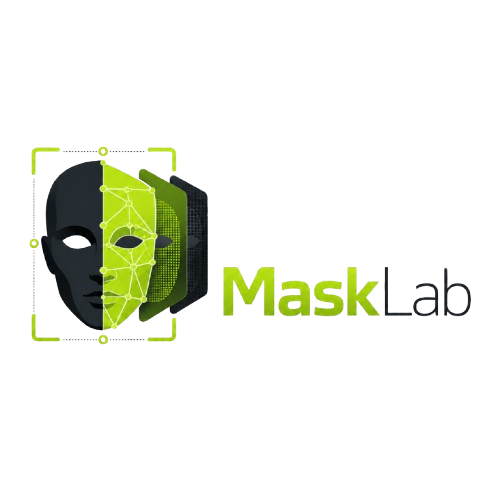

<div align="center">



**100% local image segmentation desktop app — powered by SAM3**

<br/>


</div>

---

## Overview

**MaskLab** is a local SAM3 desktop application for generating image segmentation masks from text prompts.

The app can be used in two ways:

* directly with the provided `.bat` launcher
* as a Windows desktop app built with **Electron** and `npm`

All processing runs locally on your machine.

<br/>


<div align="center">


</div>

---

## Requirements

Before running MaskLab, make sure you have:

* **Windows 10 / 11**
* **Python 3.10+**
* **PyTorch**
* a **SAM3 checkpoint**
* **Node.js + npm** only if you want to run or build the Electron desktop version

PyTorch is installed separately because the correct version depends on your hardware.

Example CPU install:

```bat
python -m pip install torch torchvision
```

For CUDA or another setup, use the official PyTorch selector:

```txt
https://pytorch.org/get-started/locally/
```

---

## Project Setup

### 1. Get the SAM3 checkpoint

MaskLab does **not** include the SAM3 checkpoint file.

You need to download it separately from the official SAM3 model page.

#### Option A — Download manually

1. Go to the official SAM3 model page on Hugging Face:

```txt
https://huggingface.co/facebook/sam3
```

2. Request access to the model if required.

3. Once access is accepted, download the checkpoint file.

4. Place the checkpoint in this folder:

```txt
sam3_model/
```

5. Rename the checkpoint file to:

```txt
sam3.pt
```

The final path should be:

```txt
sam3_model/sam3.pt
```

The default `config.json` already points to this file:

```json
{
  "checkpoint_path": "sam3_model/sam3.pt"
}
```

#### Option B — Download with Hugging Face CLI

Install the Hugging Face CLI:

```bat
python -m pip install -U huggingface_hub
```

Login with your Hugging Face token:

```bat
hf auth login
```

Then download the checkpoint from the SAM3 repository.

After downloading, place or rename the file here:

```txt
sam3_model/sam3.pt
```

If your checkpoint has another name, either rename it to `sam3.pt` or update `checkpoint_path` in `config.json`.

---

### 2. Install Python dependencies

Use the provided batch file:

```bat
install_requirements.bat
```

Or install manually:

```bat
python -m pip install -r requirements.txt
```

This installs the Python dependencies used by the FastAPI backend.

---

### 3. Install PyTorch

If PyTorch is not already installed, install it manually.

For a simple CPU install:

```bat
python -m pip install torch torchvision
```

For GPU acceleration, use the command adapted to your CUDA version from the PyTorch website.

---

## Run the App

### Option A — Launch with the `.bat` file

This is the easiest way to run MaskLab:

```bat
launch_mask_creator.bat
```

The script starts the backend and opens the interface at:

```txt
http://127.0.0.1:7860
```

If the browser does not open automatically, open this URL manually.

---

### Option B — Manual Python launch

You can also start the backend manually:

```bat
python app.py
```

Then open:

```txt
http://127.0.0.1:7860
```

---

## Quick Interface Usage

Once the app is open:

1. In **Images folder**, select the folder containing your input images.

2. In **Save folder**, select where the generated masks should be saved.

3. Click **Scan** to list the images.

4. Write a text prompt describing what you want to segment.

Examples:

```txt
cloud
```

```txt
person
```

```txt
car
```

```txt
sky
```

5. Adjust the **confidence threshold** if needed.

* Lower value = more detections, but possibly more false positives.
* Higher value = stricter detections, but some objects may be missed.

6. Click **Load** to load the SAM3 model.

7. Generate masks:

* **Generate mask** processes the selected image.
* **Generate whole folder** processes all scanned images.
* **Stop generation** cancels the current process.

8. Use the viewer tabs to inspect the result:

* **Image**: original image
* **Overlay**: mask displayed over the image
* **Mask**: binary mask only
* **Compare**: slider view to compare source and overlay

9. Download the generated mask or overlay from the result panel.

---

## Output Files

For an image named:

```txt
photo.jpg
```

MaskLab can generate:

```txt
<save_folder>/
├─ photo.png
├─ photo.json
├─ _overlay/
│  └─ photo_overlay.png
└─ _instances/
   └─ photo/
      ├─ mask_000.png
      ├─ mask_001.png
      └─ ...
```

Depending on your settings, JSON metadata and separated instance masks can be enabled or disabled.

---

## Configuration

The app uses `config.json`.

Recommended minimal configuration:

```json
{
  "checkpoint_path": "sam3_model/sam3.pt",
  "prompt": "mask",
  "confidence_threshold": 0.35,
  "save_meta_json": false,
  "save_instance_masks": true,
  "open_browser_on_start": true,
  "host": "127.0.0.1",
  "port": 7860,
  "language": "fr"
}
```

### Useful settings

| Key                     | Description                                            |
| ----------------------- | ------------------------------------------------------ |
| `checkpoint_path`       | Path to the SAM3 checkpoint file.                      |
| `prompt`                | Default prompt used by the app.                        |
| `confidence_threshold`  | Default confidence threshold.                          |
| `save_meta_json`        | Save JSON metadata or not.                             |
| `save_instance_masks`   | Save separated instance masks or not.                  |
| `open_browser_on_start` | Open the browser automatically when using Python mode. |
| `host`                  | Backend host.                                          |
| `port`                  | Backend port.                                          |
| `language`              | Interface language: `fr` or `en`.                      |

The SAM3 repo and BPE file are expected to be included inside the project.
The user normally only needs to provide the checkpoint file.

---

## Build the Desktop App with Electron

MaskLab can be built as a Windows desktop application using **Electron**.

### 1. Install npm dependencies

```bat
npm install
```

---

### 2. Run the Electron desktop version in development mode

```bat
npm start
```

This launches the Electron window and starts the local backend.

---

### 3. Build the Windows desktop app

```bat
npm run dist:win
```

This creates the Windows build in:

```txt
dist_electron/
```

---

### 4. Build only the portable `.exe`

```bat
npm run dist:portable
```

Typical generated files:

```txt
dist_electron/
├─ SAM3-Mask-Creator-Portable-1.0.0.exe
└─ SAM3-Mask-Creator-Setup-1.0.0.exe
```

---

## Quick Start

Install Python dependencies:

```bat
install_requirements.bat
```

Install PyTorch if needed:

```bat
python -m pip install torch torchvision
```

Place the SAM3 checkpoint here:

```txt
sam3_model/sam3.pt
```

Launch the app:

```bat
launch_mask_creator.bat
```

Optional Electron build:

```bat
npm install
npm run dist:win
```

---

## License

Released under the **MIT License**.

SAM3 model code belongs to its respective authors and may have its own license.

<div align="center">
<br/>

Made with 🟢 by **Loann**

</div>
